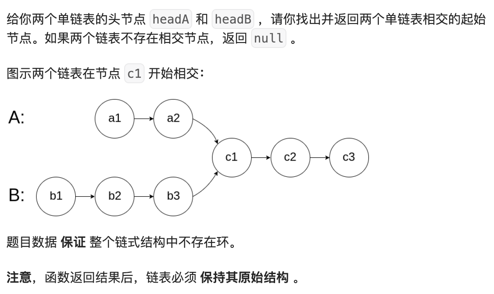

## 题目

[题目链接](https://leetcode.cn/problems/intersection-of-two-linked-lists/?envType=study-plan-v2&envId=top-100-liked)



## 思路

- 难点: 每个链表的长度不一定相同，如何找到相交点？
- 思路: 使用双指针法，两个指针分别遍历两个链表，当一个指针到达链表末尾时，跳转到另一个链表的头部。这样可以确保两个指针在相同的步数后相遇。
- 复杂度分析:
  - 时间复杂度: O(m + n)，其中 m 和 n 分别是两个链表的长度。
  - 空间复杂度: O(1)，只使用了常数级的额外空间。
- 注意事项:
  - 注意处理链表长度不相等的情况。
- 边界情况: 如果两个链表没有相交点，返回 null。

## 代码实现

```go
/**
 * Definition for singly-linked list.
 * type ListNode struct {
 *     Val int
 *     Next *ListNode
 * }
 */
func getIntersectionNode(headA, headB *ListNode) *ListNode {
    pA := headA
    pB := headB
    for pA != pB {
       if pA == nil {
        pA = headB
       } else {
        pA = pA.Next
       }

       if pB == nil {
        pB = headA
       } else {
        pB = pB.Next
       }

    }

    return pA
}
```
