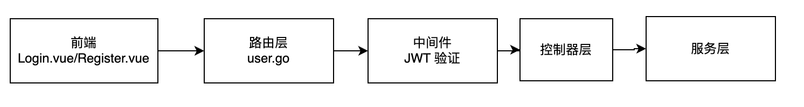

# 概述

用户模块是 AI应用平台的用户管理模块，负责用户的注册、登录、认证和管理。该模块采用 MVC 架构，使用 Gin 架构处理 HTTP 请求，集成 JWT 进行身份验证，并通过 Redis 缓存验证码、MySQL 存储用户数据。

模块支持邮件注册、账号登录、并提供安全的令牌机制确保用户会话的安全性。

# 工作流程



1. 前端。Vue 组件（Login.vue/Register.vue）发起 HTTP 请求，发送用户输入的账号密码或邮箱验证码。
2. 路由层：user.go中的 Gin 路由器匹配路径（如 user/login或user/register），并将请求分发到相应的控制器。
3. 中间件层：jwt.go中的 JWT 中间件验证请求中的令牌，确保用户身份合法。
4. 控制器层：绑定请求参数，调用服务层方法。
5. 服务层：处理业务逻辑，如验证用户信息、生成令牌、发送验证码等。
6. 数据访问层：与 MySQL 交互，查询用户存在性或插入新用户记录
7. 通用组件：Redis 缓存验证码、Email 发送账号邮件、MyJWT 生成 HS256 的 Token


# 用户模型

```mysql
type User struct {
    ID        int64          `gorm:"primaryKey" json:"id"`
    Name      string         `gorm:"type:varchar(50)" json:"name"`
    Email     string         `gorm:"type:varchar(100);index" json:"email"`
    Username  string         `gorm:"type:varchar(50);uniqueIndex" json:"username"` // 唯一索引
    Password  string         `gorm:"type:varchar(255)" json:"-"`                   // 不返回给前端
    CreatedAt time.Time      `json:"created_at"`                                   // 自动时间戳
    UpdatedAt time.Time      `json:"updated_at"`
    DeletedAt gorm.DeletedAt `gorm:"index" json:"-"` // 支持软删除
}
```

