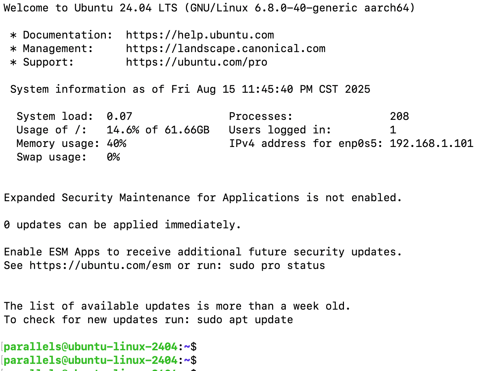

## 连接前准备

1. 确定虚拟机网络设置是「桥接模式」。
2. 在虚拟机的终端中，使用 ifconfig 命令查看虚拟机的 IP 地址。
3. 确定当前虚拟机的用户名和密码。

## 在 MAC 上连接虚拟机

1. 打开终端。
2. 使用 ssh 命令连接到虚拟机：ssh parallels@192.168.1.101 -p 22
   - 将 `parallels` 替换为你的虚拟机用户名。
   - 将 `192.168.1.101` 替换为你的虚拟机 IP 地址。
   - 将 `22` 替换为你的虚拟机 SSH 端口号（默认是 22）。
3. 输入密码以完成连接。

连接成功后，你将看到MAC的命令行界面：

## 退出

1. 输入 exit 命令退出连接。
