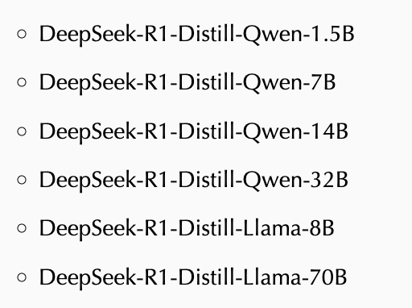
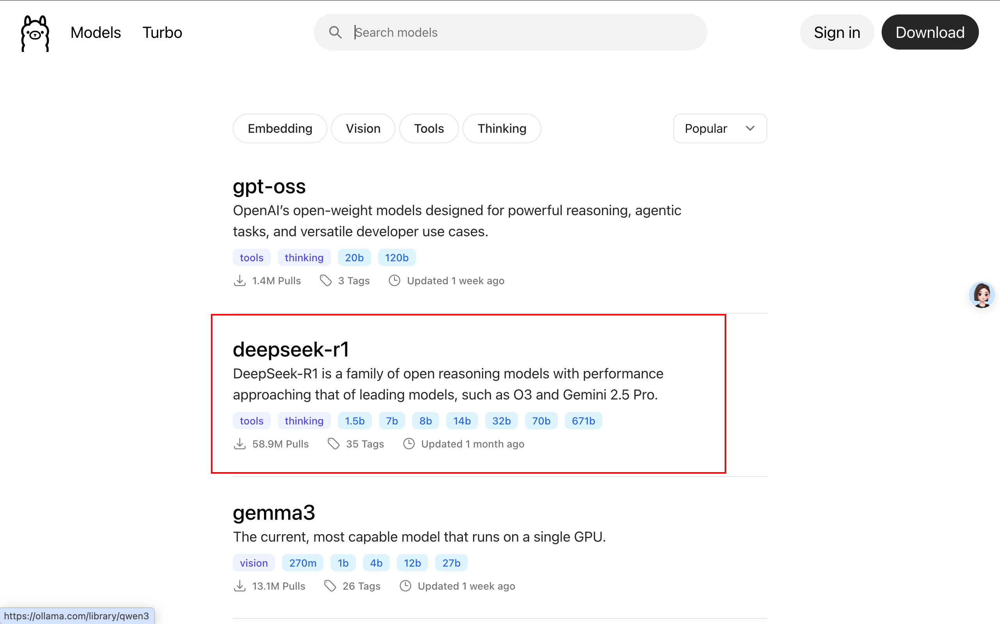
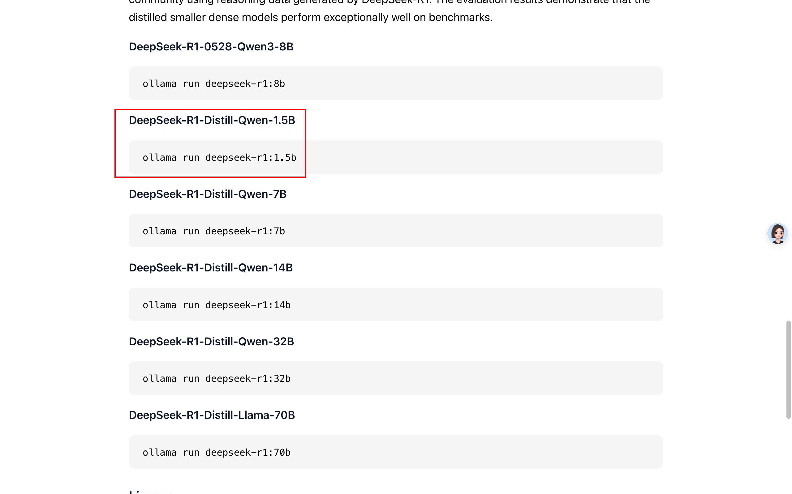

## 为什么要本地部署

本地部署大模型有很多优点：

1. 免费。本地的模型部署可以随便玩，不用担心任何付费。你只需要有一个好的设备。
2. 数据隐私。当我们使用网页版的大模型时，所有数据都需要上传到服务器进行处理，这意味着我们的数据可能被泄露。而本地部署大模型则可以完全避免这个问题，因为所有数据都存储在本地，不会上传到云端。
3. 无需网络依赖。无论是在家中还是在旅途中，只要有设备，就可以随时随地使用模型，而不必担心网络连接问题。

## 大模型的满血版和蒸馏版

本地部署大模型有一个很大的局限性，就是很依赖本地设备的硬件配置。

一般，我们普通的电脑肯定是带不动满血版的大模型，所以本地部署一般是蒸馏版。

> 蒸馏版是指通过模型蒸馏技术，将大模型压缩成小模型的过程。这个过程可以保留大模型的知识，同时减少模型的大小和计算量，从而使其能够在普通电脑上运行。
> 
> 满血版则是指未经压缩的原始模型，通常需要更强大的硬件支持。

一般的蒸馏版本有以下几种：



- DeepSeek-R1 是主模型的名字。
- Distill 表示蒸馏
- DeepSeek-R1-Distill-Qwen-32B 表示是基于阿里的开源大模型千问蒸馏而来的。
- 32B 表示模型的参数量是 32 Billion。

## 本地大模型的部署步骤

### 通过 Ollama 本地部署 DeepSeek

Ollama 是一个开源的本地大语言模型运行框架，专为在本地机器上便捷部署和运行大型语言模型（LLM）而设计。

Ollama 的下载和部署大模型可以通过以下步骤进行：

1. 访问 https://ollama.com/download
2. 根据你的操作系统选择合适的安装包进行下载。
3. 安装完成后，打开终端（Terminal）并输入 

``` bash
ollama --version # 查看版本号，确认安装成功
```

4. 在 https://ollama.com/search 中搜索 DeepSeek 模型并查看相关的下载命令。





5. 在本地终端上输入下载命令进行模型下载。

``` bash
ollama run deepseek-r1:1.5b
```


## Anything LLM + Ollama - 打通本地知识库

